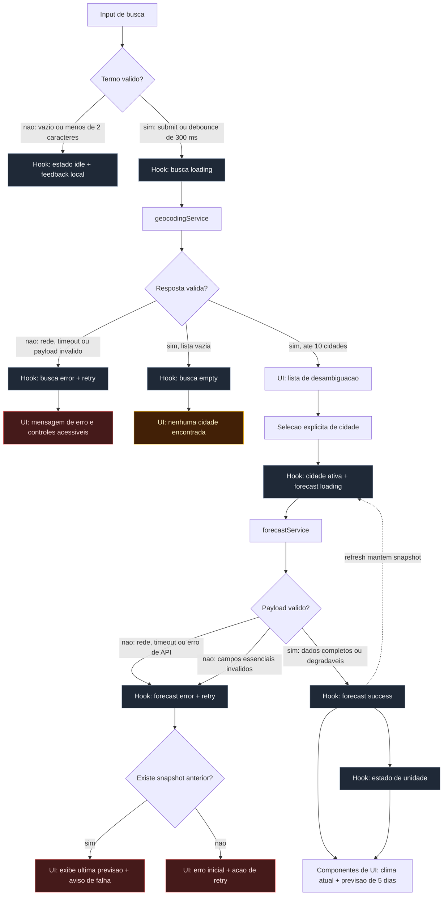

# Weather App - Plano Tecnico

Este plano deriva exclusivamente de `specs/weather-app-spec.md`. Ele define
decisoes de arquitetura e contratos entre camadas para a primeira versao, sem
descrever a implementacao final dos componentes.

## Architecture

A aplicacao sera uma SPA React/Vite mobile first, organizada em camadas com
responsabilidades unidirecionais:

1. **Apresentacao (`components/`)**: renderiza dados e estados, coleta eventos
  do usuario e emite callbacks. Componentes nao fazem `fetch`, nao conhecem o
  formato da Open-Meteo e nao decidem regras de cache ou concorrencia.
2. **Orquestracao e estado (`hooks/`)**: coordena busca, selecao, consulta,
  refresh, retry, debounce, unidade ativa e transicoes de estado. O hook
  expoe um contrato orientado a acoes para que a tela permaneça declarativa.
3. **Acesso a dados (`services/`)**: encapsula HTTP, timeout, cancelamento,
  cache em memoria e endpoints da Open-Meteo. Valida o transporte e delega o
  mapeamento de payloads para funcoes de `lib/`, retornando apenas modelos do
  dominio ou erros tipados.
4. **Funcoes puras (`lib/`)**: concentra regras deterministicas, como
  validacao e normalizacao de payloads, deduplicacao, conversao de unidades,
  arredondamento, formatacao de datas e mapeamento de codigos WMO. Nao importa
  React, nao acessa rede e nao altera estado externo.
5. **Contratos (`types/`)**: declara tipos compartilhados entre as camadas,
  sem comportamento. Tipos de resposta bruta do provedor podem ser privados
  ao respectivo service quando nao houver necessidade de compartilhamento.

O fluxo principal e `components -> hooks -> services -> lib -> services ->
hooks -> components`. A UI recebe somente modelos normalizados e estados
prontos para renderizacao. Essa fronteira atende RF01-RF06 e RNF07, permite
trocar o provedor sem alterar a apresentacao e torna cada camada substituivel.

O tema visual segue o dark glassmorphism definido nas instrucoes do projeto,
sem alterar os contratos de dominio. O primeiro feedback apos uma acao (por
exemplo, loading, erro de validacao ou resultado de cache) deve ocorrer em ate
1 segundo; o prazo de ate 5 segundos se aplica a cada requisicao externa,
respeitando o timeout definido adiante.

### Separacao e testabilidade

As regras de `lib/` podem ser testadas com entradas e saidas, sem navegador,
rede ou mocks. Os `services/` podem ser testados com `fetch` interceptado para
verificar timeout, HTTP, payload invalido e mapeamento. Os `hooks/` sao testados
com services substituidos por doubles, concentrando-se em concorrencia,
loading, retry, cache e preservacao do ultimo snapshot. Os `components/` usam
Testing Library para verificar estados, acessibilidade e callbacks, sem
repetir testes de conversao ou de protocolo HTTP. Playwright valida apenas o
fluxo integrado entre essas fronteiras.

## Tech Stack

- **TypeScript strict**: contratos explicitos e validacao antes da renderizacao.
- **React 19 + Vite**: SPA leve, adequada ao fluxo de uma cidade por vez.
- **Tailwind CSS**: estilo responsivo consistente com o tema definido pelo
  projeto, incluindo foco visivel e estados semanticos.
- **Open-Meteo**: geocodificacao e previsao sem chave ou autenticacao.
- **Vitest + Testing Library**: testes de dominio, servicos e comportamento de
  componentes.
- **Playwright**: fluxos E2E dos criterios de aceite.
- **Biome**: lint e formatacao.

Nao sera introduzida uma biblioteca global de estado, cliente HTTP ou camada de
cache externa. O escopo de uma cidade ativa nao justifica esse custo; hooks,
funcoes puras e `fetch` com `AbortController` cobrem os requisitos.

## Project Structure

Estrutura planejada, preservando as convencoes do repositorio:

```text
src/
  components/
    SearchForm.tsx              # entrada e envio; sem regra de rede
    CityResults.tsx             # lista de desambiguacao e selecao de cidade
    CurrentWeather.tsx          # clima atual e campos opcionais
    Forecast.tsx                # cinco blocos diarios
    UnitToggle.tsx              # Celsius/Fahrenheit acessivel
    WeatherView.tsx             # composicao dos estados meteorologicos
  hooks/
    useWeatherApp.ts            # orquestracao do fluxo e acoes publicas
  services/
    geocodingService.ts         # endpoint e transporte de geocodificacao
    weatherService.ts           # endpoint e transporte de forecast
    request.ts                  # fetch, timeout, erros e metricas de transporte
  types/
    weather.ts                  # contratos de dominio e estado
  lib/
    geocoding.ts                # validacao, deduplicacao e mapeamento de cidades
    weather.ts                   # validacao e mapeamento do payload meteorologico
    temperature.ts              # conversao e arredondamento
    weatherCode.ts               # codigo WMO para texto e representacao
    date.ts                      # formatacao pura de datas locais
```

`components/` depende de `hooks/` por meio de props e callbacks; `hooks/`
depende de `services/`; `services/` depende de `lib/` e `types/`. `lib/` nao
depende de camadas superiores. Os nomes sao contratos de organizacao; a
implementacao pode dividir arquivos quando crescer, desde que preserve essas
fronteiras e nao misture UI com acesso a dados.

## Data Model

Os tipos abaixo sao contratos conceituais. Os campos externos devem ser
validados e mapeados para estes modelos antes de chegarem aos componentes.

```ts
type Unit = 'celsius' | 'fahrenheit'

interface City {
  /** Identificador unico retornado pela Open-Meteo Geocoding. */
  id: number

  /** Nome principal da cidade. */
  name: string

  /** Pais da cidade, quando informado pelo provedor. */
  country?: string

  /** Estado, provincia ou regiao administrativa para desambiguacao. */
  region?: string

  /** Latitude usada na consulta de previsao. */
  latitude: number

  /** Longitude usada na consulta de previsao. */
  longitude: number
}

interface WeatherCondition {
  /** Codigo WMO retornado pela Open-Meteo. */
  code: number

  /** Texto legivel derivado do codigo WMO. */
  label: string

  /** Chave visual usada pela UI para icone/representacao. */
  iconKey: string
}

interface CurrentWeather {
  /** Temperatura atual em Celsius como valor canonico. */
  temperatureCelsius: number | null

  /** Sensacao termica em Celsius, quando disponivel. */
  apparentTemperatureCelsius: number | null

  /** Umidade relativa do ar em percentual. */
  humidityPercent: number | null

  /** Velocidade do vento a 10 m em km/h. */
  windSpeedKmh: number | null

  /** Precipitacao atual em milimetros. */
  precipitationMm: number | null

  /** Pressao de superficie em hPa. */
  pressureHpa: number | null

  /** Condicao climatica derivada de weather_code. */
  condition: WeatherCondition | null

  /** Data/hora ISO da observacao atual. */
  observedAt: string | null
}

interface ForecastDay {
  /** Data local ISO do dia previsto. */
  date: string | null

  /** Temperatura minima diaria em Celsius. */
  minTemperatureCelsius: number | null

  /** Temperatura maxima diaria em Celsius. */
  maxTemperatureCelsius: number | null

  /** Condicao climatica diaria derivada de weather_code. */
  condition: WeatherCondition | null
}

interface WeatherData {
  /** Cidade selecionada para estes dados meteorologicos. */
  city: City

  /** Condicoes atuais normalizadas. */
  current: CurrentWeather

  /** Previsao diaria normalizada em cinco posicoes. */
  forecast: ForecastDay[]

  /** Data/hora ISO em que os dados foram obtidos. */
  fetchedAt: string
}
```

`WeatherData` nao carrega a unidade ativa: o snapshot permanece canonico em
Celsius e `unit` vive exclusivamente no estado da sessao. `forecast` deve
conter cinco posicoes no modelo de sucesso. O mapeamento usa as cinco primeiras
posicoes retornadas pelo provedor, preserva a posicao mesmo quando um dia esta
incompleto e preenche uma posicao ausente com um item indisponivel. Assim, a
UI sempre consegue renderizar cinco blocos sem deslocar uma data para outra.
Temperaturas sao mantidas em Celsius como fonte canonica; a camada de
apresentacao converte e arredonda para a unidade ativa (RF04).

Estados publicos da tela devem distinguir explicitamente `idle`, `loading`,
`success`, `empty` e `error` em cada fluxo. O estado `idle` representa a
ausencia de uma operacao ativa; a tela inicial e o clima sem cidade usam esse
estado. A busca usa `loading` enquanto aguarda a geocodificacao, `success`
quando ha cidades, `empty` quando a lista e vazia e `error` quando a busca
falha. O clima usa `loading` na primeira consulta ou atualizacao, `success`
quando ha um snapshot valido e `error` quando a consulta falha. O snapshot
fica separado do status: assim, um refresh pode estar em `loading` ou `error`
sem remover o ultimo `WeatherData` valido da tela.

Erros podem ser modelados por um contrato semelhante a:

```ts
interface AppError {
  kind: 'network' | 'api' | 'timeout' | 'invalid-payload'
  message: string
  retryable: boolean
}
```

`validation` nao e uma falha de requisicao: entrada invalida permanece no
estado `idle`, com feedback local no formulario. `invalid-payload` cobre uma
resposta parcial que nao atende aos campos essenciais do dominio; uma resposta
parcial degradavel, como um campo opcional ausente ou um dia diario
incompleto, continua em `success` e carrega `null` no modelo.

## Data Flow



1. O usuario digita o termo. O valor exibido pode mudar livremente, mas a
   busca so e elegivel apos `trim` com pelo menos dois caracteres.
2. Submit ou pausa de 300 ms inicia a busca, cancelando o debounce anterior;
  o submit tambem cancela o timer pendente para nao disparar uma segunda
  requisicao. O termo normalizado e usado como chave para evitar requisicao
  duplicada na mesma sessao.
3. `geocodingService` consulta o provedor, valida cada resultado minimo,
  remove duplicatas por identificador e, como fallback, por coordenadas
  normalizadas, e retorna no maximo dez `City`, preservando a ordem relevante
  do provedor.
4. A UI apresenta os resultados como uma lista de desambiguacao. Nenhuma
  cidade e escolhida automaticamente: mesmo quando ha apenas um resultado, o
  clima so e consultado depois de `selectCity`. Cada opcao exibe nome e
  contexto geografico disponivel, tem foco visivel e pode ser ativada por
  teclado.
5. A selecao de um `City` atualiza imediatamente a cidade ativa e inicia a
   consulta meteorologica. Resultados antigos nao podem sobrescrever a
   selecao mais recente.
6. `weatherService` consulta cinco dias em Celsius, valida o payload e produz
  `WeatherData`. Campos opcionais incompletos tornam-se `null`; um dia diario
   incompleto ocupa sua posicao com valores indisponiveis. Um payload sem
   estrutura essencial, sem os campos essenciais do clima atual ou sem uma
   lista diaria utilizavel e rejeitado como invalido.
7. O hook atualiza o status do fluxo com `loading`, `success`, `empty` ou
  `error`; o snapshot de clima e mantido separadamente. Durante refresh, o
  ultimo snapshot valido permanece disponivel mesmo enquanto o status muda.
8. A UI recebe o snapshot canonico em Celsius, a unidade ativa e funcoes de
  apresentacao. A cada renderizacao, a camada de apresentacao calcula o valor
  exibido sem alterar o snapshot: `Celsius = round(valorCelsius)` e
  `Fahrenheit = round(valorCelsius * 9 / 5 + 32)`. A troca de unidade apenas
  atualiza `unit`, nao chama a API e nao converte um valor ja arredondado.
9. Atualizar repete a consulta usando a cidade ativa, preserva a cidade e pode
   ser ignorado enquanto uma atualizacao equivalente estiver em andamento.

Busca e clima devem ter caches em memoria separados. A chave de clima combina
coordenadas normalizadas a seis casas decimais e a chave de busca e o termo
normalizado em minusculas. O cache de busca evita uma nova requisicao para o
mesmo termo durante a sessao; a selecao de uma cidade pode reutilizar um
snapshot em cache. `refresh` sempre ignora o cache de clima, atualiza o cache
com a resposta nova e preserva o snapshot anterior enquanto aguarda. Tambem
deve haver deduplicacao de requisicoes em andamento pela mesma chave. O cache
nao deve persistir dados entre sessoes nem exige TTL nesta versao, pois a
atualizacao manual e a forma explicita de obter dados novos.

## External APIs

### Geocoding

`GET https://geocoding-api.open-meteo.com/v1/search`

Parametros relevantes:

- `name`: termo normalizado;
- `count=10`;
- `language=pt`;
- `format=json`.

Os parametros devem ser montados com `URL`/`URLSearchParams`; o termo de busca
e as coordenadas nunca sao concatenados diretamente na URL. O service usa
somente a entrada normalizada e nao solicita permissao de localizacao.

Exemplo resumido de resposta:

```json
{
  "results": [
    {
      "id": 3451190,
      "name": "Sao Paulo",
      "latitude": -23.55,
      "longitude": -46.63,
      "country": "Brazil",
      "admin1": "Sao Paulo",
      "timezone": "America/Sao_Paulo"
    }
  ],
  "generationtime_ms": 0.4
}
```

Mapeamento para `City`:

- `results[].id` -> `City.id`;
- `results[].name` -> `City.name`;
- `results[].country` -> `City.country`;
- `results[].admin1`, usando `admin2` como fallback, -> `City.region`;
- `results[].latitude` e `results[].longitude` -> coordenadas de `City`.

Somente resultados com nome, identificador, latitude e longitude numericos
podem ser mapeados. A lista deve ser limitada a dez cidades e deduplicada
por `id` e, como fallback, por coordenadas normalizadas antes de chegar a UI.
Resposta sem `results` ou com lista vazia e um
resultado de dominio `empty`, nao um erro de transporte.

### Forecast

`GET https://api.open-meteo.com/v1/forecast`

Parametros relevantes:

- `latitude` e `longitude` da cidade selecionada;
- `current=temperature_2m,apparent_temperature,relative_humidity_2m,wind_speed_10m,precipitation,surface_pressure,weather_code` para os dados atuais;
- `daily=weather_code,temperature_2m_min,temperature_2m_max` para os dados diarios;
- `forecast_days=5`;
- `temperature_unit=celsius`;
- `wind_speed_unit=kmh`;
- `timezone=auto` para que `current.time` e `daily.time` usem o fuso da
  coordenada consultada.

Exemplo resumido de resposta:

```json
{
  "latitude": -23.55,
  "longitude": -46.63,
  "timezone": "America/Sao_Paulo",
  "current": {
    "time": "2026-09-16T10:00",
    "temperature_2m": 22.4,
    "apparent_temperature": 22.8,
    "relative_humidity_2m": 68,
    "wind_speed_10m": 9.7,
    "precipitation": 0.0,
    "surface_pressure": 1012.4,
    "weather_code": 2
  },
  "daily": {
    "time": ["2026-09-16", "2026-09-17"],
    "temperature_2m_min": [17.1, 16.8],
    "temperature_2m_max": [25.4, 24.9],
    "weather_code": [2, 61]
  }
}
```

Mapeamento para o modelo de dados:

- `current.temperature_2m` -> `CurrentWeather.temperatureCelsius`;
- `current.apparent_temperature` -> `CurrentWeather.apparentTemperatureCelsius`;
- `current.relative_humidity_2m` -> `CurrentWeather.humidityPercent`;
- `current.wind_speed_10m` -> `CurrentWeather.windSpeedKmh`;
- `current.precipitation` -> `CurrentWeather.precipitationMm`;
- `current.surface_pressure` -> `CurrentWeather.pressureHpa`;
- `current.weather_code` -> `CurrentWeather.condition.code`, com `label` e
  `iconKey` derivados pela tabela de codigos WMO;
- `current.time` -> `CurrentWeather.observedAt`;
- para cada indice `i` dos arrays diarios, `daily.time[i]` ->
  `ForecastDay.date`, `daily.temperature_2m_min[i]` ->
  `ForecastDay.minTemperatureCelsius`, `daily.temperature_2m_max[i]` ->
  `ForecastDay.maxTemperatureCelsius` e `daily.weather_code[i]` ->
  `ForecastDay.condition`.

Os valores de `current_units` e `daily_units`, quando retornados, servem para
validar o contrato de unidades, mas nao substituem os nomes dos campos no
modelo. Como a requisicao fixa `temperature_unit=celsius` e
`wind_speed_unit=kmh`, as temperaturas e o vento sao armazenados nas unidades
canonicas definidas em `CurrentWeather` e `ForecastDay`; a conversao para
Fahrenheit ocorre somente na apresentacao. Os arrays diarios devem ser
validados em conjunto: cada indice representa o mesmo dia. As cinco primeiras
posicoes de `time` definem os cinco blocos; valores ausentes, invalidos ou
inexistentes em uma posicao viram campos `null`, sem compactar o array. A
ausencia de `time` ou de todas as posicoes diarias rejeita o payload, assim
como a ausencia dos dados essenciais de `current`.

O cliente deve verificar HTTP, JSON e a correspondencia entre arrays diarios
(`time`, minima, maxima e codigo). A data retornada pelo provedor e a fonte do
dia local da cidade. Toda chamada tem timeout de 5 segundos; timeout, falha de
rede e payload invalido viram `AppError` sem expor detalhes tecnicos na UI.

## State Management

Um hook de orquestracao no nivel da pagina concentra o estado da sessao:

```ts
interface WeatherAppState {
  query: string
  unit: Unit
  selectedCity: City | null
  searchResults: City[]
  search: {
    status: 'idle' | 'loading' | 'success' | 'empty' | 'error'
    error: AppError | null
  }
  weather: {
    status: 'idle' | 'loading' | 'success' | 'error'
    snapshot: WeatherData | null
    error: AppError | null
  }
}
```

O estado inicial usa Celsius, busca em `idle`, clima em `idle`, sem cidade e
sem snapshot. `searchResults` so e consumido quando a busca esta em
`success`; nesse estado, a UI renderiza a lista de desambiguacao e aguarda
`selectCity`, sem iniciar automaticamente uma consulta meteorologica. Quando
esta em `empty`, a UI exibe a mensagem de ausencia de resultados. `unit` permanece no hook durante toda a sessao e nao vai para
localStorage. Acoes publicas do hook devem cobrir `submitSearch`,
`selectCity`, `setUnit`, `refresh` e `retry`, permitindo que componentes
permaneçam apresentacionais. `setUnit` nunca altera `weather.snapshot`: os
valores em Fahrenheit sao derivados na renderizacao a partir dos Celsius
canonicos, inclusive para clima atual e os cinco dias.

Cada requisicao recebe um identificador ou sinal de cancelamento para impedir
que respostas fora de ordem alterem a cidade ou o termo atuais. Debounce,
cache e deduplicacao ficam no fluxo do hook/servico, nao em componentes
individuais.

## Error Handling

- **Entrada invalida**: nao requisita; mantém o formulario acessivel e informa
  que sao necessarios pelo menos dois caracteres.
- **Busca sem resultados**: exibe `Nenhuma cidade encontrada para “X”.` e
  preserva o formulario.
- **Resultados ambiguos ou multiplos**: exibe ate dez opcoes em uma lista
  acessivel, identificadas por nome e contexto geografico, e nao consulta o
  clima ate que o usuario selecione uma cidade.
- **Resultado unico**: exibe a opcao como resultado selecionavel e tambem
  aguarda a selecao explicita antes de consultar o clima.
- **Falha de geocodificacao**: exibe `Não foi possível localizar cidades.
  Tente novamente.` com retry explicito.
- **Clima inicial com falha**: mantém a cidade selecionada e exibe erro com
  acao de retry, sem apresentar um painel vazio como sucesso.
- **Refresh com falha**: preserva o ultimo `WeatherData` e exibe
  `Não foi possível atualizar os dados. Mostrando a última previsão disponível.`
- **Falha de rede**: classifica ausencia de conectividade, erro de DNS ou
  falha de `fetch` como `network`; mantém os controles acessiveis e oferece
  retry manual.
- **Erro de API/provedor**: classifica resposta HTTP nao-2xx ou payload de
  erro retornado pelo provedor como `api`; nao exibe detalhes tecnicos e
  permite nova tentativa quando a falha for temporaria.
- **Timeout**: usa `AbortController` para encerrar cada requisicao em 5
  segundos e classifica o resultado como `timeout`; a UI oferece retry e,
  durante refresh, preserva o snapshot anterior.
- **Resposta parcial ou invalida**: campos opcionais ausentes e dias
  individuais incompletos viram `null`/“indisponivel” e mantêm o estado
  `success`. Ausencia ou invalidade dos campos essenciais, JSON malformado,
  arrays diarios desalinhados ou resposta nula viram `invalid-payload` e
  estado `error`; valores invalidos em uma posicao diaria viram
  indisponibilidade, sem compactar os demais dias. Nunca renderizar `NaN`,
  `undefined` ou valores de arrays estruturalmente desalinhados.
- **Cliques repetidos**: desabilita ou torna idempotente a acao enquanto a
  mesma operacao esta em andamento.

Mensagens criticas devem usar regioes semanticas (`status`/`alert` conforme o
caso), nao depender apenas de cor e manter foco e teclado utilizaveis. A
camada de transporte deve aceitar um callback opcional de metricas para
registrar duracao, resultado, tipo do erro e endpoint sem dados de entrada.
Esse callback e no-op por padrao; um adaptador de hospedagem pode encaminhar
as metricas sem adicionar um servico externo ao escopo. Nunca registrar o
termo completo, coordenadas precisas ou qualquer dado pessoal (RNF02 e RNF09).

## Requirements Traceability

| Requisito | Decisao no plano | Verificacao |
| --- | --- | --- |
| RF01 / AC01 | debounce de 300 ms, submit sem duplicacao, cache por termo, ate dez cidades e selecao explicita para desambiguacao | testes de lib, service, hook, componentes e E2E de busca/erro/vazio/desambiguacao |
| RF02-RF03 / AC02-AC03 | modelos normalizados, WMO, cinco posicoes diarias e campos `null` | testes de `lib/weather.ts`, componentes e E2E de sucesso/incompleto |
| RF04 / AC04 | Celsius canonico e conversao somente na apresentacao | testes de temperatura, hook e E2E sem nova requisicao |
| RF05-RF06 / AC05-AC06 | snapshot separado do status, retry, loading, erro, vazio e indisponibilidade | testes de hook/componentes e E2E de refresh/retry |
| RNF01-RNF02, RNF05 | Tailwind dark glassmorphism, mobile first, foco, labels, teclado e viewport de 320 px | Testing Library e Playwright mobile/desktop |
| RNF03-RNF04 | feedback imediato, timeout de 5 s, AbortController, cache e retry manual | testes de service/hook e medicao de duracao no callback |
| RNF06-RNF07 | sem GPS/dados pessoais; camadas separadas e payloads validados | revisao de service/UI e testes de validacao |
| RNF08-RNF09 | ultima previsao preservada; metricas tecnicas opcionais e sem PII | teste de refresh com falha e contrato do callback de metricas |

O objetivo de 99,5% de disponibilidade nao pode ser garantido apenas pelo
frontend enquanto a Open-Meteo for dependencia externa. Nesta versao, a
decisao verificavel e manter a tela utilizavel com cache/snapshot, timeout e
retry; a medicao de disponibilidade do provedor fica a cargo do ambiente de
hospedagem quando houver suporte.

## Testing Strategy

A estrategia segue a mesma fronteira de camadas da arquitetura: cada nivel e
testado no seu proprio isolamento com Vitest, e o Playwright valida apenas a
integracao ponta a ponta que nenhum teste unitario cobre sozinho.

### Vitest — funcoes puras (`lib/`)

Sem rede, sem DOM e sem mocks; apenas entrada e saida.

- `temperature.ts`: conversao Celsius/Fahrenheit, arredondamento e que a
  conversao nunca reescreve o valor canonico em Celsius;
- `weatherCode.ts`: mapeamento de codigo WMO para `label`/`iconKey`,
  incluindo codigos desconhecidos;
- `date.ts`: formatacao de datas locais a partir de strings ISO;
- `geocoding.ts`: validacao de campos essenciais, deduplicacao por `id` ou
  coordenadas normalizadas e limite de dez cidades;
- `weather.ts`: validacao de payload completo, vazio, nulo e parcialmente
  incompleto; alinhamento dos arrays diarios por indice; degradacao de um
  dia individual para `null` sem rejeitar os demais.

### Vitest — services (`services/`) com `fetch` mockado

`fetch`/`AbortController` interceptados com `vi.fn`; nunca chamam a rede real.

- mapeamento de resposta valida para os modelos de dominio;
- erro HTTP nao-2xx classificado como `AppError.kind = 'api'`;
- timeout de 5s via `AbortController` classificado como `kind = 'timeout'`;
- falha de rede/DNS classificada como `kind = 'network'`;
- payload malformado ou JSON invalido classificado como
  `kind = 'invalid-payload'`;
- cancelamento de requisicao obsoleta quando uma nova selecao/consulta
  substitui a anterior.

### Vitest — hooks (`hooks/`) com services substituidos por doubles

- transicoes de `status` (`idle -> loading -> success/empty/error`) para
  busca e para clima;
- preservacao do `weather.snapshot` durante refresh com falha;
- debounce, cache em memoria e supressao de busca redundante;
- resultados de busca permanecem disponiveis ate uma selecao explicita;
- busca com multiplos resultados nao dispara forecast automaticamente;
- lista limitada a dez opcoes, com nome, contexto geografico, foco visivel e
  ativacao por teclado;
- `setUnit` altera apenas `unit`, nunca `weather.snapshot`, e nao dispara
  requisicao;
- concorrencia: resposta fora de ordem nao sobrescreve a cidade/termo atuais.

### Vitest — componentes (Testing Library)

Cada componente e testado nos estados relevantes ao seu contrato, via props
diretamente controladas (sem depender do hook real):

- **loading**: indicador visivel, regiao `status` anunciada e controles
  desabilitados/idempotentes quando aplicavel;
- **erro**: mensagem tratada por tipo (`network`, `api`, `timeout`,
  `invalid-payload`), acao de retry acessivel por teclado e uso de
  `role="alert"` quando pertinente;
- **vazio**: mensagem de ausencia de resultados de busca e formulario
  preservado;
- **sucesso**: renderizacao dos campos de `CurrentWeather`, dos cinco blocos
  de `ForecastDay` e do valor exibido convertido para a unidade ativa;
- **desambiguacao**: renderizacao de uma lista com 2 a 10 cidades, contexto
  geografico por opcao, foco e ativacao por teclado; a selecao dispara apenas
  uma consulta para a cidade escolhida;
- **dados incompletos**: campos `null` exibidos como indisponiveis, sem
  `NaN`/`undefined` na tela;
- acessibilidade: labels, roles, ordem de foco e navegacao por teclado no
  formulario e no seletor de unidade.

### Playwright — fluxos E2E

Com respostas da Open-Meteo interceptadas (sem chamada real de rede), cobrir
os fluxos dos AC01-AC06 de ponta a ponta pela UI renderizada:

- buscar termo valido, selecionar cidade e carregar clima atual e previsao;
- buscar termo com multiplas correspondencias, verificar no maximo dez opcoes,
  confirmar que nenhuma consulta meteorologica ocorre antes da escolha e
  carregar o clima da cidade selecionada;
- buscar termo com mais de dez correspondencias e verificar que somente as
  dez primeiras na ordem do provedor sao exibidas;
- buscar termo com uma unica correspondencia e confirmar a selecao explicita
  antes de carregar o clima;
- termo sem resultados e falha de geocodificacao, cada uma com sua mensagem;
- alternar unidade sem nova requisicao de rede e manter a unidade ao trocar
  de cidade;
- atualizar com estado de loading e preservar o ultimo snapshot ao falhar;
- retry apos falha inicial de busca ou de clima;
- **viewport mobile** (320 px) sem rolagem horizontal, com todos os blocos e
  o seletor de unidade utilizaveis por toque;
- viewport desktop como verificacao complementar de responsividade.

Os testes verificam texto acessivel e quantidade de blocos renderizados, nao
detalhes fragilizados de implementacao visual (classes CSS, estrutura DOM
interna). O checklist de entrega permanece `pnpm lint`, `pnpm build` e
`pnpm test`, com `pnpm test:e2e` para os cenarios de aceitacao.

## Risks & Trade-offs

- **Dependencia da Open-Meteo**: sem backend proprio ou fallback de provedor,
  a disponibilidade externa limita a atualizacao. Mitigacao: timeout,
  mensagens claras, retry e ultima previsao preservada. *Alternativa
  considerada*: backend proprio como proxy/cache; descartada por adicionar
  infraestrutura, custo e complexidade de deploy sem requisito da spec.
- **Ambiguidade de cidades**: nomes iguais podem confundir. Mitigacao:
  retornar ate dez resultados, mostrar pais/regiao, manter o identificador
  geografico no contrato e exigir selecao explicita antes do forecast.
  *Alternativa considerada*: escolher automaticamente o primeiro resultado;
  descartada porque pode consultar a localidade errada. *Outra alternativa*:
  exibir todos os resultados do provedor; descartada para preservar legibilidade
  e limitar o custo visual da lista.
- **Dados diarios incompletos**: arrays do provedor podem ter valores nulos ou
  desalinhados. Mitigacao: validar por indice, degradar cada dia
  individualmente e rejeitar apenas payloads sem estrutura essencial.
  *Alternativa considerada*: rejeitar o payload inteiro se qualquer dia
  estiver incompleto; descartada por reduzir a disponibilidade da tela sem
  necessidade, quando so um dia falha.
- **Arredondamento de unidades**: converter o valor canonico em Celsius a cada
  renderizacao evita acumulo de erro, mas pode produzir diferenca de um grau
  por arredondamento. Esse e o comportamento explicitamente definido pela
  spec. *Alternativa considerada*: persistir o valor ja convertido e
  arredondado por unidade; descartada por acumular erro de arredondamento em
  trocas sucessivas de unidade.
- **Cache em memoria**: reduz requisicoes e latencia na sessao, mas pode
  exibir dados antigos. A atualizacao manual deve sempre poder buscar dados
  novos e a UI deve exibir o horario da consulta quando disponivel.
  *Alternativa considerada*: sem cache, buscando a cada interacao;
  descartada por gerar requisicoes redundantes e piorar a latencia percebida
  em trocas rapidas de unidade/cidade.
- **Estado local em vez de biblioteca global**: e simples e suficiente para
  uma cidade, mas exigiria revisao se surgirem favoritos, comparacao ou
  multiplas telas com dados compartilhados. *Alternativa considerada*:
  Redux/Zustand desde o inicio; descartada por over-engineering frente ao
  escopo de uma cidade ativa por vez.
- **Observabilidade no cliente**: metricas dependem do ambiente de execucao.
  O plano limita o registro a eventos tecnicos sem localizacao precisa e nao
  promete um painel operacional nesta primeira versao. *Alternativa
  considerada*: enviar eventos a um servico externo de telemetria;
  descartada por exigir backend/chave e por risco de exposicao de dados
  pessoais (RNF09).
- **Acessibilidade e telas pequenas**: densidade de dados pode causar
  sobreposicao em 320 px. Mitigacao: layout responsivo, blocos independentes,
  foco visivel, texto descritivo e testes E2E nos limites de viewport.
  *Alternativa considerada*: layout fixo apenas para desktop com scroll
  horizontal em mobile; descartada por violar a diretriz mobile first e
  prejudicar a usabilidade em toque.
- **Testes E2E com mocks de rede**: Playwright intercepta as respostas da
  Open-Meteo em vez de bater na API real. Isso torna os testes deterministicos
  e rapidos, mas nao detecta mudancas de contrato do provedor em producao.
  *Alternativa considerada*: chamadas reais nos testes E2E; descartada por
  tornar a suite instavel (rate limit, latencia, indisponibilidade externa).

Ficam fora deste plano autenticacao, persistencia entre sessoes, GPS,
favoritos, historico, comparacao de cidades, previsao horaria, offline
completo, notificacoes, PWA e troca multilanguage, conforme a decisao de
escopo da especificacao.